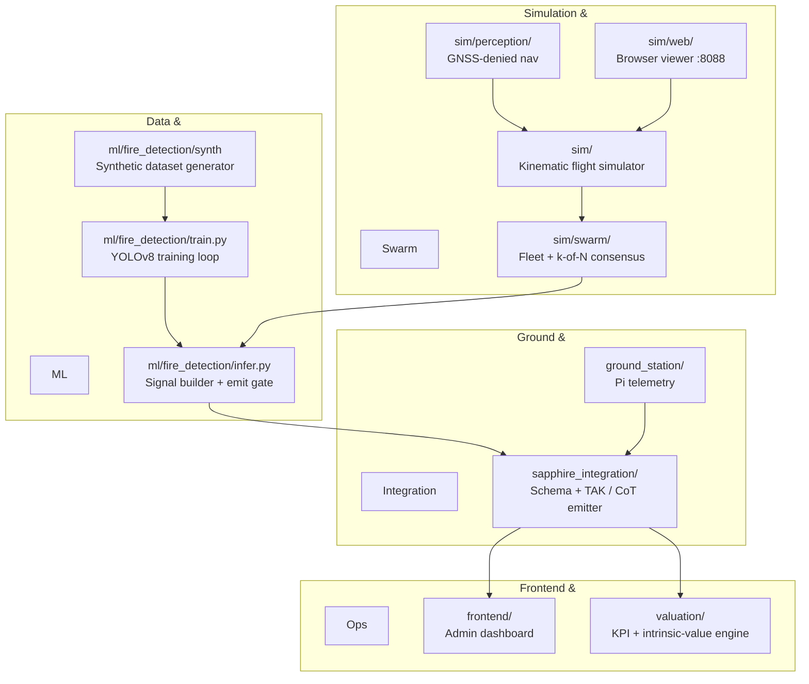

# wildfire-watch

[](#status)
[](LICENSE)
[](#status)
[](https://github.com/arigatoexpress/wildfire-watch/actions/workflows/ci.yml)

**A county-scale autonomous drone fleet that detects wildfires before human spotters can.**
The first 30 minutes decide whether a fire stays under an acre or burns 1,000 structures. Satellites, mountaintop cameras, and 911 calls miss that window in the wildland-urban interface; we don't.
Civilian wildfire is the wedge. Multimodal edge fusion, swarm consensus, GNSS-denied vision navigation, and TAK/CoT interop on a Blue-UAS-substitutable BOM are the moat — Anduril, Palantir, Ondas, Red Cat, and Kratos are the strategic acquirers we design toward.

---

## What this is

wildfire-watch is the small, autonomous, NDAA-clean patrol layer that closes the **0–30 minute wildfire-detection gap**. RGB + LWIR + acoustic + behavioral wildlife fusion on a $249 Jetson Orin Nano Super, riding a 3D-printable airframe whose BOM is engineered to be Blue-UAS substitutable. The same platform that finds an ignition over the Slate River drainage at 7,700 ft can — without redesign — feed Lattice, Foundry, Apollo, or any TAK-Server-federated system already on a county fire chief's tablet.

**AOR:** Gunnison Valley + Crested Butte corridor, Gunnison County, Colorado. Beetle-killed lodgepole pine + Engelmann spruce. Sharp WUI. Short, explosive June–September fire season. Wilderness boundaries (West Elk, Maroon Bells-Snowmass, Raggeds) are non-negotiable no-fly zones per 36 CFR 261.16. See [`AOR.md`](AOR.md).

## What sets this apart

| | This | ALERTCalifornia | GOES / VIIRS satellites | Anduril Lattice | DJI consumer |
|---|---|---|---|---|---|
| **Detection latency** | sub-30 min target | minutes (cameras) | hours (revisit) | seconds (military) | n/a |
| **Spatial resolution** | drone-altitude, sub-meter | fixed viewpoints | ~375 m | classified | photo-grade |
| **WUI coverage** | gap-fill at 7,700–9,000 ft | blind spots | always-overhead, low-res | DoD only | none |
| **NDAA Blue-UAS path** | substitutable BOM by design | n/a | n/a | yes | **fails by 2027** |
| **TAK/CoT interop** | yes (8 type codes) | no | no | yes | no |
| **Cost per node** | $2,613 (Phase 1) | $50K+ camera tower | satellite-share | classified | $599 |
| **Open BOM** | yes | no | no | no | no |
| **Resilient to vendor disappearance** | yes (3D-printable, open BOM) | no | no | no | no |

The differentiator is **the missing complementary layer**. We're not replacing ALERTCalifornia, satellites, or Lattice. We're the autonomous, locally-buildable, county-scale mesh that fills the sub-acre, sub-30-minute window everything else misses.

## Status

As of 2026-05-02, on `main`:

- **467 tests passing.** Full suite under 7 seconds. `python3 -m pytest -q`.
- **~13,700 LOC Python** across 142 source files; ~4,600 LOC docs.
- **Kinematic flight simulator** with deterministic seeding, Mavic Mini 2 airframe profile, scripted detection events, DJI-Fly-compatible SRT subtitle output, JSONL flight log per tick.
- **Browser flight viewer** at `:8088` — Leaflet 2D map with planned route, flown polyline, signal pins, geofence overlay, live fusion-gate charts (Chart.js), SSE replay at configurable speed. Vanilla JS, no npm.
- **Multi-drone swarm + k-of-N consensus** with a lossy-comms model. Three drones over the 1 km² Slate River drainage produced a CONFIRMED smoke signal at risk_score 97.33, `recommended_action=notify_fire_dept`.
- **GNSS-denied vision navigation primitive** — VO + TRN + IMU + complementary fusion + GPS-spoof discriminator. 60-second GPS outage at 80 m AGL: fused position stayed within **1.39 m mean / 2.15 m max** of truth. Catches `deliberate_jam_burst` injections every tick.
- **TAK / Cursor-on-Target XML emitter** — every `wildfire_signal v1` ships as a CoT event over TCP / UDP / TLS / multicast. 8 type-code mappings: smoke, fire, thermal anomaly, wildlife, anomaly, system event, drone self-position, AOR geofence.
- **Continuous intrinsic-value engine.** Four-method valuation (comp-multiples, venture-method, dcf-lite, asset-floor) over a live KPI snapshot scraped from the repo. CLI + web dashboard at `:8090`. History appended per snapshot.
- **Sapphire integration** — `wildfire_signal v1` schema → `signal_logger:18081` adapter → bridge tool at `~/Code/Sapphire/plugins/claw-sapphire/tools/wildfire.py` (PR #551, MERGED).
- **Acquirer-fit research** — Anduril, Palantir, Ondas, Red Cat, Kratos with cited 2026 evidence in [`docs/strategy/`](docs/strategy/).

What we do **not** have: zero flight hours · zero printed parts · no signed Letter of Authorization · no trained production ML model. The detector is a placeholder colour heuristic; the FASDD → FLAME-2 fine-tune is Phase 1.

## Quickstart (60 seconds to a post-flight map)

Python 3.11+. Apple Silicon and Linux x86_64 both work. No GPU required for the simulator.

```bash
# 1. Run the full test suite (under 7 seconds)
/usr/local/bin/python3 -m pytest -q

# 2. Fly one drone over the Gunnison Slate River drainage with a synthetic plume
/usr/local/bin/python3 -m sim.cli run sim/missions/gunnison_slate_river_1km2.yaml \
    --scenario single_smoke_plume --speed-multiplier 5

# 3. Open the browser viewer (auto-loads the flight you just produced)
/usr/local/bin/python3 -m sim.web.server   # http://127.0.0.1:8088

# 4. Compute the current intrinsic-value band
/usr/local/bin/python3 -m valuation.cli snapshot
```

A first-time reader is looking at the post-flight map within 60 seconds of cloning.

## Architecture



`build_signal()` and `should_emit()` in `ml/fire_detection/infer.py` are the single source of truth for signal construction and emit-gating. The simulator, post-flight processor, swarm consensus voter, and TAK emitter all compose against these — no duplicate logic.

## Packages

| Package | Stack | Description |
|---|---|---|
| `ml/fire_detection` | Python, PIL, NumPy, Ultralytics (lazy), OpenCV (lazy) | Synthetic fire/smoke dataset generation, YOLOv8 training, and the live inference gate that builds every `wildfire_signal`. |
| `sim` | **stdlib only** — no NumPy/SciPy/SimPy | Deterministic kinematic flight simulator with deterministic seeding, swarm consensus, and GNSS-denied vision navigation. |
| `frontend` | Flask 3.x, Gunicorn, vanilla JS, Leaflet, Chart.js | Admin dashboard. Containerised for Cloud Run. |
| `valuation` | stdlib + PyYAML | Continuous intrinsic-value band (comp-multiples, venture-method, DCF-lite, asset-floor) and a live KPI dashboard. |
| `sapphire_integration` | Python, requests, jsonschema | Canonical `wildfire_signal` v1 JSON schema, TAK/CoT XML emitter, and Foundry ontology adapter. |
| `ground_station` | Python | Raspberry Pi heartbeat and system-event emitters. |
| `lib` | Python | Reusable backtest and forecast utilities. |

## Repo map

| Path | Purpose |
|---|---|
| [`ml/fire_detection/`](ml/fire_detection/) | Detector: `infer.py`, `train.py` (FASDD → FLAME-2), `demo.py`, `mavic_post_flight.py` |
| [`ground_station/`](ground_station/) | Pi (rari1 / rari2) heartbeat + system-event emitter |
| [`sapphire_integration/`](sapphire_integration/) | Bridge to Sapphire — schema, adapter, [`tak/`](sapphire_integration/tak/) CoT emitter |
| [`sim/`](sim/) | Kinematic flight simulator, browser viewer, swarm, perception |
| [`valuation/`](valuation/) | Continuous intrinsic-value engine + KPI dashboard |
| [`hardware/bom.csv`](hardware/bom.csv) | Phased BOM with `phase` column |
| [`missions/zones/`](missions/zones/) | Canonical AOR zones (5 features incl. wilderness exclusion) |
| [`docs/strategy/`](docs/strategy/) | Acquirer-fit research + positioning brief |
| [`docs/intel/`](docs/intel/) | Foundry, Ukraine drones, low-cost hardware, Phase 0 deep research |
| [`docs/SIMULATION_LADDER.md`](docs/SIMULATION_LADDER.md) | Tier 1 kinematic → Tier 2 ArduPilot SITL → Tier 3 PX4 + Gazebo → Tier 4 HITL |
| [`AOR.md`](AOR.md), [`CLAUDE.md`](CLAUDE.md) | Operational area and AI-pair-programming context |

## Hardware tiers

Phase 0 ships **today** on hardware already in hand.

| Tier | Cost | Stack | Mission |
|---|---:|---|---|
| **Phase 0** | $0 | DJI Mavic Mini 1/2 + Mac mini + Pis (rari1 / rari2) | Manual scout flights, post-flight YOLO on Mac, Pi heartbeat, simulator-only autonomy |
| **Phase 0.5** | $215 | + RTL-SDR Blog v4, Plantower PMS5003, Bosch BME688, 2× Heltec V3 Meshtastic, Pi 5 AI HAT+ Hailo-8L | ADS-B + RAWS receive, direct smoke sensing, license-free LoRa mesh, edge YOLOv8-fire at 30+ FPS |
| **Phase 1** | $2,613 | Holybro X500 V2 + Cube Orange+ + Jetson Orin Nano Super 8 GB + Arducam IMX477 + FLIR Lepton 3.5 + uAvionix pingRX/pingRID | Autonomous patrol, RGB + LWIR fusion, ADS-B In + Remote ID compliant |

The Mavic Mini is a Phase-0 stopgap, **not** a foundation. 2026 NDAA + Countering CCP Drones Act + DoD Section 848: any DJI bet expires by 2027. The valuation engine flags `ndaa_blue_uas_eligible=False` while DJI components are in the BOM. Migration to Holybro / Cube / Jetson is planned from day one.

Phase 0.5 explicitly does **not** include a Flipper Zero — see [`docs/intel/low-cost-hardware-2026-05-01.md`](docs/intel/low-cost-hardware-2026-05-01.md). A $40 RTL-SDR beats it on every relevant axis here.

## Roadmap

The wedge is civilian wildfire detection in Gunnison-Crested Butte. The moat is the platform underneath. The 12-month plan moves from a $0–$2.83M consensus-band-today to a **$25–75M strategic-conversation band by mid-2027** by adding flight hours, a signed LOA, a trained model, and a Blue-UAS-lineage document. Path to a $150–400M outcome by late-2028 stays open as long as we hit milestones in order. Math + four-method valuation: [`docs/strategy/POSITIONING_BRIEF-2026-05-02.md`](docs/strategy/POSITIONING_BRIEF-2026-05-02.md), [`docs/strategy/SYNTHESIS-2026-05-02.md`](docs/strategy/SYNTHESIS-2026-05-02.md). Quarterly milestones: [`docs/60-roadmap.md`](docs/60-roadmap.md).

The single highest-leverage move on the dashboard right now is **one cold email to the Crested Butte Fire Protection District**. A signed LOA adds an estimated $3M to the mid-band. Same cost as a stamp.

## Deployment

### Frontend (Cloud Run)

The admin frontend is built from `frontend/Dockerfile`:

```bash
docker build -f frontend/Dockerfile -t gcr.io/tho-ai-agent/wildfire-frontend .
docker push gcr.io/tho-ai-agent/wildfire-frontend:latest
gcloud run deploy wildfire-frontend \
  --image gcr.io/tho-ai-agent/wildfire-frontend:latest \
  --region us-central1 --project tho-ai-agent --allow-unauthenticated
```

CI automatically builds and pushes the image on every push to `main` using Google Cloud Workload Identity Federation (see `.github/workflows/ci.yml`).

### ML Training Pipeline

The synthetic training pipeline is wired to CI on `main` pushes and `workflow_dispatch`:

1. Generates a small synthetic dataset (`ml/fire_detection/synth/cli.py generate`).
2. Validates the manifest.
3. Runs a 1-epoch CPU smoke-test to ensure the training loop starts cleanly.

Trigger manually from the GitHub Actions tab or via:

```bash
gh workflow run ci.yml --ref main
```

## Why this matters

The Marshall Fire (Boulder County, CO, December 2021) burned more than 1,000 structures in a single day; comparable WUI conflagrations have repeated annually since. Beetle-killed timber across the GMUG National Forest has multiplied the standing-dead fuel load across the AOR. Drought is structural. A county-scale fleet of cheap, autonomous, locally-built drones is more resilient than any single satellite — if one node fails, the mesh keeps flying. If one vendor disappears, the open BOM and 3D-printable frame let a local makerspace build a replacement.

We are not firefighters. We do not drop water. We do not fly into active fires. We are not a replacement for ALERTCalifornia or satellite-based detection. We are the missing complementary layer.

## Contributing

This is a small, fast-moving project. Most useful contributions today:

1. **File issues** for bugs, simulator scenarios, AOR zones needing GeoJSON, BOM substitutions improving the Blue-UAS path.
2. **PR new simulator scenarios** under `sim/scenarios/` — synthetic plume seeds, lighting conditions, wind profiles, GPS-denied flight slices.
3. **PR Cursor-on-Target type-code mappings** under `sapphire_integration/tak/cot_types.py` if you find a TAK ecosystem gap.
4. **PR partner-agency contact templates** to `docs/50-fire-dept-partnership.md` — current is California-flavored, needs Colorado siblings.
5. **AI-pair-programming context.** Read [`CLAUDE.md`](CLAUDE.md) and [`AGENTS.md`](AGENTS.md) before generating code.

### Development setup

```bash
pip install -e ".[dev]"
python3 -m pytest -q
ruff check .
```

### Branches & commits

- Branch from `main`: `git checkout -b feat/your-feature-name`.
- Use [Conventional Commits](https://www.conventionalcommits.org/): `feat(sim): ...`, `fix(ml): ...`, `docs(readme): ...`.
- All 538 tests must pass before merge. CI runs on every PR.

### Code style

- **stdlib-first** where possible.
- **No NumPy, SciPy, or SimPy in `sim/`** — deliberately stdlib-only for portability.
- **Schema changes are versioned** — bump `schema_version` and update all consumers.
- **No emoji in source files.**
- Keep `pyproject.toml` pins as lower bounds (`>=`) rather than hard `==` pins.

## Cross-link

This repo is the **physical-world sensing satellite** of the Sapphire intelligence stack. Sapphire ingests our v1 wildfire signals via the merged bridge tool and folds them into the cross-silo [Brain](https://sapphirealpha.xyz/api/brain/synthesis). Sapphire orchestrates; we stand alone with our own simulator, valuation engine, and TAK emitter.

- [Sapphire](https://github.com/arigatoexpress/Sapphire) — capital intelligence + content + autonomous ops monorepo
- [cyber-threat-bot](https://github.com/arigatoexpress/cyber-threat-bot) — CISA KEV / NVD / MITRE feed aggregator
- [regional-intel-workbench](https://github.com/arigatoexpress/regional-intel-workbench) — public-source regional analyst console

## License

[Apache-2.0](LICENSE), chosen explicitly over MIT for the patent grant. Hardware, firmware, and ML model contributions invite patent disputes from incumbent drone manufacturers (DJI, Skydio); the Apache-2.0 patent grant is the right shield for a project intending to remain open while inviting community ground-truth contributions.

## Citation

```
arigatoexpress. wildfire-watch: A county-scale autonomous drone fleet for sub-30-minute
wildfire detection in the wildland-urban interface. 2026.
GitHub: https://github.com/arigatoexpress/wildfire-watch
DOI: TBD
```
