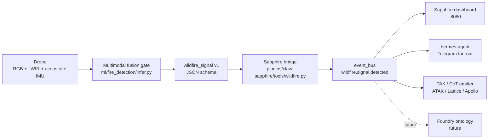

# wildfire-watch

> A county-scale autonomous drone fleet that detects wildfires before human spotters, generates an open ecological data stream as a side effect, and runs on a decentralized volunteer-builder model that doesn't depend on any one vendor.

[](#status-today)
[](LICENSE)
[](#status-today)
[](https://github.com/arigatoexpress/wildfire-watch/actions/workflows/ci.yml)

<!-- TODO: replace with a recorded GIF of the simulator at sim/web on a real run -->
<!-- placeholder: simulator in action — record me -->
`[ animated GIF placeholder: simulator in action — record me ]`

wildfire-watch is the small, autonomous, NDAA-clean patrol layer that closes the 0–30 minute wildfire-detection gap that satellites, mountaintop cameras, and 911 calls miss. It is built dual-use from day one with multimodal edge fusion (RGB + LWIR + acoustic + behavioral wildlife) on a $249 Jetson Orin Nano Super, riding a 3D-printable airframe whose BOM is engineered to be Blue-UAS substitutable. Civilian wildfire is the wedge. Autonomous patrol, multimodal sensor fusion, swarm consensus, GNSS-denied vision navigation, and TAK/CoT interop are the moat. The same platform that finds an ignition over the Slate River drainage at 7,700 ft can — without redesign — feed Lattice, Foundry, Apollo, or any TAK-Server-federated system already on a county fire chief's tablet.

---

## What is this

A research-and-flight project building a county-scale autonomous wildfire patrol mesh. The operational area (AOR) is the **Gunnison Valley + Crested Butte corridor in Gunnison County, Colorado** — high-elevation montane forest at 7,700–9,000+ ft, dominated by beetle-killed lodgepole pine and Engelmann spruce, with sharp wildland-urban interface and a short, explosive June–September fire season. Partner agencies of record (priority order): Crested Butte Fire Protection District, Gunnison County FPD, Mt. Crested Butte FPD, and the GMUG National Forest Gunnison Ranger District. Wilderness boundaries (West Elk, Maroon Bells-Snowmass, Raggeds) are non-negotiable no-fly zones per 36 CFR 261.16. See [`AOR.md`](AOR.md) for the complete brief.

The civilian wildfire mission is the entry point. The platform underneath — autonomous patrol, multimodal sensor fusion, mesh comms, ontology integration, GNSS-denied vision navigation — is what makes it strategically defensible. We design toward five potential strategic acquirers (none promised): **Anduril, Palantir, Ondas Holdings, Red Cat Holdings, Kratos Defense**. The acquirer-fit research is in [`docs/strategy/`](docs/strategy/).

---

## Status (today)

As of 2026-05-02, on `main` at commit `e3ec1b0`:

- **240 tests passing.** Full suite runs in under 7 seconds. `python3 -m pytest -q`.
- **~13,700 lines of Python** across 142 source files; ~4,600 lines of documentation.
- **Kinematic flight simulator** with deterministic seeding, Mavic Mini 2 airframe profile, scripted detection events, DJI-Fly-compatible SRT subtitle output, and a JSONL flight log per tick.
- **Browser-based flight viewer** at `:8088` — Leaflet 2D map with planned route, flown polyline, signal pins, geofence overlay, live fusion-gate charts (Chart.js), and SSE replay at configurable speed. Vanilla JS, no npm.
- **Multi-drone swarm + k-of-N consensus voting** with a lossy-comms model. Three drones over the 1 km² Slate River drainage produced a CONFIRMED smoke signal at risk_score 97.33 with `recommended_action=notify_fire_dept`.
- **GNSS-denied vision navigation primitive** — visual odometry + terrain-relative-nav + IMU + complementary fusion + GPS-spoof discriminator. Tested 60-second GPS outage at 80 m AGL: fused position stayed within 1.39 m mean / 2.15 m max of truth. Catches `deliberate_jam_burst` injections every tick.
- **TAK / Cursor-on-Target XML emitter.** Every wildfire_signal v1 can be emitted as a CoT event to a TAK Server / ATAK / WinTAK / iTAK / multicast SA mesh over TCP, UDP, TLS, or multicast. 8 type-code mappings covering smoke, fire, thermal anomaly, wildlife, anomaly, system event, drone self-position, and AOR geofence.
- **Continuous intrinsic-value engine.** Four-method valuation (comparable-multiples, venture-method, dcf-lite, asset-floor) over a live KPI snapshot scraped from the repo. CLI + web dashboard at `:8090`. History appended per snapshot.
- **Sapphire integration** wired through the `signal_logger:18081` adapter, `wildfire_signal v1` schema (UUIDv4 signal IDs, regex-validated drone IDs, six signal types), and a merged bridge tool at `~/Code/Sapphire/plugins/claw-sapphire/tools/wildfire.py` (Sapphire PR #551).
- **Acquirer-fit research + positioning brief** in [`docs/strategy/`](docs/strategy/) — Anduril, Palantir, Ondas, Red Cat, Kratos with cited 2026 evidence.

What we do NOT have today: zero flight hours, zero printed parts, no signed Letter of Authorization, no trained production ML model. The detector is a placeholder colour heuristic; the FASDD → FLAME-2 fine-tune is a Phase 1 deliverable.

---

## Quick start

Python 3.11+. Apple Silicon and Linux x86_64 both work. No GPU required to run the simulator.

```bash
# 1. Clone
git clone <this-repo> wildfire-watch && cd wildfire-watch

# 2. Run the full test suite (under 7 seconds)
/usr/local/bin/python3 -m pytest -q

# 3. Fly a single drone over the Gunnison Slate River drainage with a synthetic smoke plume
/usr/local/bin/python3 -m sim.cli run sim/missions/gunnison_slate_river_1km2.yaml \
    --scenario single_smoke_plume --speed-multiplier 5

# 4. Open the browser viewer (auto-loads the flight you just produced)
/usr/local/bin/python3 -m sim.web.server   # http://127.0.0.1:8088

# 5. Compute the current intrinsic-value band
/usr/local/bin/python3 -m valuation.cli snapshot
```

A first-time reader can be looking at the post-flight map in the browser within 60 seconds of cloning.

---

## Architecture at a glance



`build_signal()` and `should_emit()` in `ml/fire_detection/infer.py` are the single source of truth for signal construction and emit-gating. The simulator, the post-flight processor, the swarm consensus voter, and the TAK emitter all compose against these — no duplicate logic.

---

## Repo map

| Path | Purpose |
|---|---|
| [`ml/fire_detection/`](ml/fire_detection/) | Detector core: `infer.py` (live loop), `train.py` (FASDD → FLAME-2 plan), `demo.py` (synthetic replay), `mavic_post_flight.py` (Mavic SD-card processor), tests |
| [`ground_station/`](ground_station/) | Pi (rari1 / rari2) heartbeat + system-event emitter |
| [`sapphire_integration/`](sapphire_integration/) | Bridge to the Sapphire intelligence stack — schema, adapter, and the [`tak/`](sapphire_integration/tak/) Cursor-on-Target emitter |
| [`sim/`](sim/) | Kinematic flight simulator (Mavic-shaped). 84 tests. CLI: `python -m sim.cli run <mission> --scenario <name>` |
| [`sim/web/`](sim/web/) | Browser viewer — Flask + Leaflet + Chart.js + SSE. `python -m sim.web.server` → `:8088` |
| [`sim/swarm/`](sim/swarm/) | N-drone fleet + k-of-N consensus + lossy-comms model |
| [`sim/perception/`](sim/perception/) | GNSS-denied vision-nav primitive (VO + TRN + IMU + complementary fusion + spoof detection) |
| [`valuation/`](valuation/) | Continuous intrinsic-value calculator + KPI dashboard |
| [`hardware/bom.csv`](hardware/bom.csv) | Phased BOM. `phase` column tags rows phase-0.5 / phase-1 |
| [`missions/zones/`](missions/zones/) | Canonical AOR zones (5 features incl. wilderness exclusion) |
| [`docs/strategy/`](docs/strategy/) | Acquirer-fit research + positioning brief |
| [`docs/intel/`](docs/intel/) | Foundry, Ukraine drones, low-cost hardware, Phase 0 deep-research docs + SYNTHESIS |
| [`docs/SIMULATION_LADDER.md`](docs/SIMULATION_LADDER.md) | Tier 1 kinematic → Tier 2 ArduPilot SITL → Tier 3 PX4 + Gazebo → Tier 4 HITL |
| [`docs/PHASE_0_QUICKSTART.md`](docs/PHASE_0_QUICKSTART.md) | Operator quickstart for Mavic + Mac + Pis |
| [`docs/PHASE_0_RUNBOOK.md`](docs/PHASE_0_RUNBOOK.md) | Step-by-step SD-card flow: power on, drop card, run harness, watch dashboard |
| [`AOR.md`](AOR.md) | Source of truth for the operational area |
| [`CLAUDE.md`](CLAUDE.md) | North-star context for AI-pair-programming |

---

## Hardware tiers

Three deliberate cost tiers. Phase 0 ships **today** on hardware already in hand.

| Tier | Cost | Stack | Mission |
|---|---:|---|---|
| **Phase 0** | $0 | DJI Mavic Mini 1/2 + Mac mini + Raspberry Pis (rari1 / rari2) — already owned | Manual scout flights, post-flight YOLO on Mac, Pi heartbeat, simulator-only autonomy |
| **Phase 0.5** | $215 | + RTL-SDR Blog v4, Plantower PMS5003 PM2.5/PM10, Bosch BME688, 2× Heltec V3 Meshtastic, Pi 5 AI HAT+ Hailo-8L | ADS-B + RAWS receive, direct smoke sensing, license-free LoRa mesh, edge YOLOv8-fire at 30+ FPS |
| **Phase 1** | $2,613 | Holybro X500 V2 + Cube Orange+ + Jetson Orin Nano Super 8 GB + Arducam IMX477 + FLIR Lepton 3.5 + uAvionix pingRX/pingRID | Autonomous patrol, RGB + LWIR multimodal fusion, ADS-B In + Remote ID compliant |

The Mavic Mini is a Phase-0 stopgap, not a foundation. The 2026 NDAA, Countering CCP Drones Act, and DoD Section 848 environment make any DJI bet expire by 2027. The valuation engine flags `ndaa_blue_uas_eligible=False` while DJI components are in the BOM. Migration to Holybro / Cube / Jetson is planned from day one.

Phase 0.5 explicitly does **not** include a Flipper Zero — see [`docs/intel/low-cost-hardware-2026-05-01.md`](docs/intel/low-cost-hardware-2026-05-01.md) for the analysis. A $40 RTL-SDR beats it on every relevant axis here.

---

## Roadmap

The wedge is civilian wildfire detection in Gunnison-Crested Butte. The moat is the platform underneath — multimodal fusion, swarm consensus, GNSS-denied perception, TAK interop, NDAA-substitutable BOM. The 12-month plan moves from $0–$2.83M consensus-band-today to a $25–75M strategic-conversation band by mid-2027 by adding flight hours, an LOA, a trained model, and a Blue-UAS-lineage document. The path to a $150–400M outcome by late-2028 stays open as long as we hit the milestones in order. Detail and the four-method valuation math are in [`docs/strategy/POSITIONING_BRIEF-2026-05-02.md`](docs/strategy/POSITIONING_BRIEF-2026-05-02.md) and [`docs/strategy/SYNTHESIS-2026-05-02.md`](docs/strategy/SYNTHESIS-2026-05-02.md). Quarterly milestones are in [`docs/60-roadmap.md`](docs/60-roadmap.md).

The single highest-leverage move on the dashboard right now is one cold email to the Crested Butte Fire Protection District. A signed LOA adds an estimated $3M to the mid-band. Same cost as a stamp.

---

## Why this matters

The first 30 minutes of a wildfire decide whether it stays under an acre or becomes catastrophic. Existing detection layers — ALERTCalifornia and similar fixed-camera networks (1,240 cameras with fixed viewpoints), GOES / VIIRS satellites (~375 m resolution, hours of revisit latency), and 911 calls (slow, often after smoke is already large) — all have documented blind spots in the wildland-urban interface, the highest-consequence terrain. The Marshall Fire (Boulder County, CO, December 2021) burned more than 1,000 structures in a single day; comparable WUI conflagrations have repeated annually since. Beetle-killed timber across the GMUG National Forest has multiplied the standing-dead fuel load across the AOR. Drought is structural. A county-scale fleet of cheap, autonomous, locally-built drones is more resilient than any single satellite — if one node fails, the mesh keeps flying. If one vendor disappears, the open BOM and 3D-printable frame let a local makerspace build a replacement.

We are not firefighters. We do not drop water. We do not fly into active fires. We are not a replacement for ALERTCalifornia or satellite-based detection. We are the missing complementary layer covering the sub-acre, sub-30-minute window that everything else misses.

---

## Contributing

This is a small, fast-moving project. The most useful contributions today:

1. **File issues** for bugs, simulator scenarios that should exist, AOR zones that need GeoJSON, BOM substitution candidates that improve the Blue-UAS path.
2. **PR new simulator scenarios** under `sim/scenarios/` — synthetic plume seeds, lighting conditions, wind profiles, GPS-denied flight slices.
3. **PR Cursor-on-Target type-code mappings** under `sapphire_integration/tak/cot_types.py` if you find a TAK ecosystem gap.
4. **PR partner-agency contact templates** to `docs/50-fire-dept-partnership.md`. The current template is California-flavored and needs Colorado-flavored siblings.
5. **AI-pair-programming context.** `CLAUDE.md` is the canonical entry point for any AI assistant working on this repo. Read it before generating code.

Code style: stdlib-first. No NumPy, no SciPy, no SimPy in `sim/` (deliberately). No emoji in code or docs. Schema changes are versioned — see the `Gotchas` section of [`CLAUDE.md`](CLAUDE.md).

---

## License

[Apache-2.0](LICENSE), chosen explicitly over MIT for the patent grant. Hardware, firmware, and ML model contributions invite patent disputes from incumbent drone manufacturers (DJI, Skydio); the Apache-2.0 patent grant is the right shield for a project intending to be acquired by a defense-adjacent company while remaining open enough to invite community ground-truth contributions.

---

## Citation

If you reference this work, please cite as:

```
arigatoexpress. wildfire-watch: A county-scale autonomous drone fleet for sub-30-minute
wildfire detection in the wildland-urban interface. 2026.
GitHub: https://github.com/arigatoexpress/wildfire-watch
DOI: TBD
```

A formal arXiv preprint with the multimodal-fusion benchmark vs. ALERTCalifornia detection-time delta is on the 12-month roadmap.
