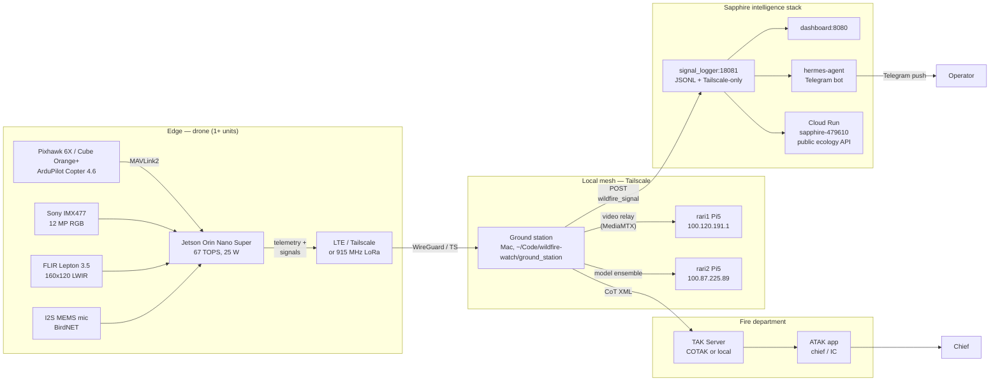

# System Architecture

## Tier diagram

## Data flow (fire detection event)

1. **Sensor capture** — 30 fps RGB + 9 fps thermal frames, ring-buffered on Jetson.
2. **On-edge inference** — YOLOv8n-fire (FP16, TensorRT) runs at ~120 FPS on Orin Nano
   Super; Lepton 3.5 thermal frame goes through a thresholding pass + a small
   classifier. Wildlife head (MegaDetector v6 Compact) runs at 1 Hz on a separate
   thread.
3. **Multimodal fusion** — RGB-detected smoke + thermal hot pixel + GPS coord →
   single `wildfire_signal` event. Confidence = weighted sum (RGB conf, thermal
   delta-T, persistence across N frames, wind-direction consistency).
4. **Edge gating** — drone only emits signals above `confidence_threshold`
   (configurable per zone, default 0.65). Anything above 0.85 triggers an
   in-flight loiter to capture additional evidence frames.
5. **Uplink** — JSON `wildfire_signal` POSTed to ground station over Tailscale
   (preferred) or LTE backup. Schema: [`sapphire_integration/wildfire_signal_schema.json`](../sapphire_integration/wildfire_signal_schema.json).
6. **Ground station fan-out**:
   - To `signal_logger:18081` — Sapphire stack (dashboard, Telegram via hermes).
   - To TAK Server — CoT XML message with type `a-f-G-U-C-F` (friendly UAS, fire
     marker), pushed to ATAK clients on chief / IC handsets.
   - To MediaMTX — live RTSP video stream from drone for IC verification.
7. **Cold storage** — full RGB + thermal frames + telemetry uploaded to GCS
   (`gs://wildfire-watch-evidence/{zone_id}/{date}/{signal_id}/`) for retraining.

## Why Sapphire integration (not standalone)

- **Existing infra**: signal_logger already binds to Tailscale-only (100.64.0.0/10
  CGNAT), already JSONL-persists, already fans out to Telegram. We get
  multi-tenant signals (trading + fire) on the same plumbing.
- **Operator parity**: hermes-agent on the operator's phone already paginates
  alerts. A 3 a.m. fire alert comes through the same channel as a position-sized
  trading alert, with the same paper-trail.
- **Pi cluster reuse**: rari1 / rari2 are already on Tailscale, already host
  Ollama for inference fallback. They're free GPU-less compute for the wildfire
  ensemble (RGB + thermal cross-validation, anomaly model).
- **Auditable**: data/trading_signals.jsonl pattern → data/wildfire_signals.jsonl
  on the same dashboard, same access controls, same backup story.

## Failure modes & mitigations

| Failure | Effect | Mitigation |
|---|---|---|
| Lost LTE | No uplink | Tailscale via 915 MHz mesh radio (Meshtastic) as backup; on-edge JSONL persists, syncs on reconnect |
| Jetson OOM / crash | Inference dies | Pixhawk return-to-launch is independent; ArduPilot fail-safe brings the drone home |
| False positive | Wasted dispatch | Edge gating + ground-station 2-of-N quorum (rari1 + rari2 cross-check before TAK push) |
| GPS denial | Drift, possible fly-away | ArduPilot EKF3 with optical flow + barometer; geofence enforced as hard limit |
| Bird strike / motor failure | Crash | Auto-land + Adafruit Mini-GPS beacon + UTM remote-ID compliance |
| Public-airspace conflict | Manned aircraft proximity | ADS-B In receiver on drone (uAvionix pingRX), instant land-and-hold below 200 ft AGL |

## Coordinate systems

- **Drone**: WGS-84 lat/lon, AGL altitude (barometer + rangefinder fusion).
- **TAK / CoT**: WGS-84 + MSL altitude (converted at ground station).
- **Sapphire signals**: WGS-84 lat/lon/alt-AGL, ISO 8601 UTC timestamps.
- **Mission zones**: GeoJSON with `crs:OGC:1.3:CRS84`.
