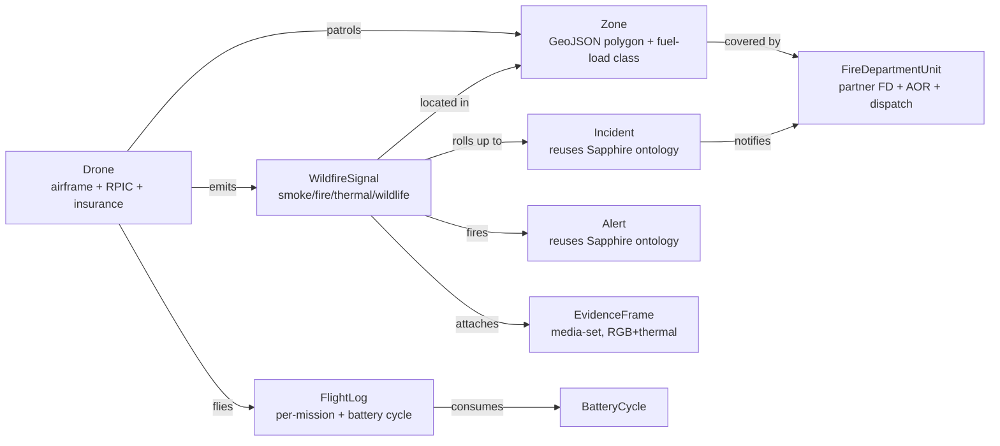

# Palantir Foundry research — wildfire-watch

**Date:** 2026-05-01
**Author:** Sapphire research agent (Opus 4.7, 1M context)
**Scope:** Whether and how to use Palantir Foundry as the data backbone for the wildfire-watch drone project.
**Companion docs:** `~/Code/Sapphire/docs/foundry-strategy-2026-04-19.md`, `~/Code/Sapphire/docs/foundry-ontology-schema.md`, `~/Code/Sapphire/docs/palantir-foundry-strategy-2026-04-19.md`.
**Pitch status:** 2026-04-28 partnership pitch outstanding (per Sapphire memory `project_palantir_pitch.md`); diligence packet is Sapphire PR #341.

---

## 1. TL;DR

- **Recommendation: conditional yes.** Stand up Postgres+PostGIS this week as the wildfire-watch system of record. *Apply to the free Foundry/AIP Developer Tier in parallel* and use it for the ontology, semantic search, AIP Logic agents, and the demo surface that earns partnership credibility — not as the primary signal store.
- The free Developer Tier is real, capacity-limited, and metered in compute-seconds + storage; you cannot accidentally incur charges. That is the right shape of risk for an unfunded MVP. The signup path is `build.palantir.com` / `aip.palantir.com`, plus the AIP Bootcamp pathway that *already runs a wildfire-management track*.
- There is real Palantir public-safety precedent (PG&E PSPS, the "AIP Bootcamp: Applying AI for Wildfire Management" curriculum, Apollo for edge, Skykit for comms-degraded ops) but **no published direct CAL FIRE / USFS / BLM Foundry contract** for drone-tier UAS work. That niche is open — which is exactly where wildfire-watch should plant the flag.
- Reuse > rebuild. The existing Sapphire `lib/foundry/` client + `services/foundry_sync/` daemon + the `wildfire_signal` JSON schema in this repo cover ~70% of the integration. Add three new ontology object types (`Drone`, `Zone`, `FireDepartmentUnit`), reuse `Alert` and `Incident`, add a `WildfireSignal` transform, and the existing 15-minute delta-aware sync handles the rest.
- **Risk to size up-front:** vendor lock-in on the ontology and AIP Logic prompt graphs is real. Mitigate by (a) keeping Postgres as authoritative, (b) writing the AIP Logic prompts as portable text artifacts in the repo, and (c) treating Foundry as a *governed mirror*, not a primary store. If Palantir says no to the partnership, you lose the demo surface — not the operational system.

---

## 2. Free / cheap entry points (2026 status)

### 2.1 The Developer Tier (this is the path)

- **What it is:** A free, capacity-limited tier of Foundry + AIP. Palantir staff confirm in their own community forum: *"a free tier of Foundry / AIP and you won't be charged"*, with limits "baked in, so you won't be able to accidentally exceed them and incur any charges. Instead you will just hit the limits." See [Developer Tier Billing and Usage — Palantir Developer Community](https://community.palantir.com/t/billing-and-usage/1074).
- **Metering basis:** Foundry compute-seconds and storage. Specific allocations are exposed inside the platform on a "Your Plan" page in Control Panel rather than published publicly.
- **Where to sign up:** [build.palantir.com](https://build.palantir.com/) ("Build with AIP") or [aip.palantir.com](https://aip.palantir.com/) ("AIP Now"). Both lead to the Developer Tier enrollment flow. Onboarding requires name, email, phone, address.
- **What's included free:** Code Workspaces with the default VS Code profile run at usage rate 0. Speedrun: Your First End-to-End Workflow course at [learn.palantir.com](https://learn.palantir.com/) is free.
- **AIP features GA in 2026:** AIP Document Intelligence became generally available **2026-02-04** and is enabled by default for all AIP enrollments — including Developer Tier ([February 2026 announcements](https://www.palantir.com/docs/foundry/announcements/2026-02)). For wildfire-watch, this matters because incident reports, fire-weather PDFs, and CAL FIRE bulletins become first-class corpus.
- **Eligibility caveat:** Enrollment is "limited-capacity". Plan for a queue. There is also an active community thread *"Need access to Foundry"* ([link](https://community.palantir.com/t/need-access-to-foundry/6450)) suggesting capacity is real.

### 2.2 Foundry for Builders / startup pricing

Confirmed via UK Digital Marketplace listings: Palantir runs reduced-rate "Apollo / Foundry for Builders" programmes for startups, but the public surface is thin. The practical 2026 path is: **start on Developer Tier, then engage sales for a Builders quote if you outgrow it.** The pitch you already sent on 2026-04-28 is the right vehicle for that conversation.

### 2.3 Apollo as a deploy mechanism

Apollo is the deployment plane. For wildfire-watch the relevant feature is *edge deployment with intermittent connectivity* — Apollo lets you specify when/when-not-to-upgrade based on bandwidth or operational state ([Apollo for the Edge PDF, Palantir 2022](https://www.palantir.com/assets/xrfr7uokpv1b/ECuz16kcqKOQ2P0jBBnVy/fd84e054ee75b9baf9151851d1c30bf9/ApolloForEdge.pdf)). You won't touch this in MVP — the Mac mini + ground-station Docker stack already covers it — but it is the right answer if/when wildfire-watch ships to a partner FD with their own ruggedized hardware in a fire camp.

### 2.4 AIP Logic / Agent Studio / Workshop on Developer Tier

- AIP Logic is no-code function authoring backed by LLMs and the ontology ([AIP Logic Overview](https://www.palantir.com/docs/foundry/logic/overview)). Token usage and a 5-minute execution limit apply when called from Workshop or function APIs (debugger is exempt).
- AIP Agent Studio is GA and is the right home for the wildfire-watch operator copilot, *after* the ontology exists.
- Workshop is the operator-facing surface for FD partners.
- Maps in Foundry support H3Index, GeoJSON, and raster — directly relevant for zone polygons + drone trajectories ([Geospatial overview](https://www.palantir.com/docs/foundry/geospatial/overview)).

### 2.5 AIP Bootcamp — the actually-relevant path

Palantir runs an **AIP Bootcamp curriculum titled "Applying AI for Wildfire Management, Preparedness and Response"** ([blog.pvmit.com](https://blog.pvmit.com/pvm-blog/aip-bootcamp-wildfire)). This is unusually on-the-nose for a single-operator wildfire drone project. It is the single highest-leverage outreach asset to mention in any follow-up to the 2026-04-28 pitch.

### 2.6 Public-safety relationship owners at Palantir

No public org chart. Inferred routes:
1. The forward-deployed-engineer (FDE) job listing for "Year at Palantir" explicitly names *"How do we predict and mitigate wildfire risks to optimize power grids?"* as a sample problem ([Lever job posting](https://jobs.lever.co/palantir/030ece08-c341-4959-bdfe-314e89b691ce)). FDEs in the energy/utilities vertical are the practical owners of PG&E PSPS and are the closest internal advocates for a wildfire UAS use case.
2. Palantir Impact ([palantir.com/impact/partner-in-crises](https://www.palantir.com/impact/partner-in-crises/)) is the public-good / non-revenue arm. Wildfire-watch fits their narrative cleanly.
3. The Community team ([community.palantir.com](https://community.palantir.com/)) is the operational gate for Developer Tier and Builders escalations.

---

## 3. Public-safety precedent

| Deployment | Foundry / AIP / Skykit role | Source | Wildfire-watch read-across |
|---|---|---|---|
| **PG&E Public Safety Power Shutoff (PSPS)** | Foundry as integrated decision platform for shutoff scoping, risk-model + grid-condition fusion, auditable trace | [palantir.com/impact/pacific-gas-and-electric](https://www.palantir.com/impact/pacific-gas-and-electric/), [PSPS docs](https://www.palantir.com/docs/foundry/use-case-examples/public-safety-power-shutoff-psps-scoping) | Strongest single precedent. PSPS operates on the same fundamental object — a geospatial risk score over a polygon — that wildfire-watch produces. The audit-trace argument transfers directly to FD partner credibility. |
| **AIP Bootcamp: Wildfire Management** | Curriculum exists. Implies trained FDEs and reusable patterns | [blog.pvmit.com — AIP Bootcamp wildfire](https://blog.pvmit.com/pvm-blog/aip-bootcamp-wildfire) | Cite this in the partnership follow-up. It signals the use case is already validated internally. |
| **CAL FIRE direct Foundry deployment** | **Not found in public sources.** | — | A whitespace. Wildfire-watch can credibly position as the data-and-drone source layer for a future CAL FIRE Foundry workflow. |
| **USFS / BLM UAS for fire** | Active drone programs but contracts go to *Drone Amplified* (aerial ignition, $750k contract) and *Overwatch Aero* (long-endurance UAS with Esri stack) — not Palantir | [Drone Amplified press](https://droneamplified.com/u-s-forest-service-and-drone-amplified-partner-to-drive-search-for-domestic-fire-fighting-drones/), [Esri ArcNews on Overwatch Aero](https://www.esri.com/about/newsroom/arcnews/startup-fights-wildfires-with-drones-and-real-time-gis), [USFS UAS](https://www.fs.usda.gov/managing-land/fire/aviation/uas) | The federal UAS-for-fire data plane is dominated by Esri/ArcGIS, not Foundry. This is competitive intelligence, not a fit gap. |
| **DoD FireGuard / IRWIN / NIFC** | FireGuard is DoD-satellite-driven 15-minute fire mapping; IRWIN is the federal interagency data spine; both surface through ArcGIS | [iaa-nifc.hub.arcgis.com/pages/fireguard](https://iaa-nifc.hub.arcgis.com/pages/fireguard) | Wildfire-watch should consume IRWIN as a Foundry data connection (or a Postgres ETL) for ground truth. No Palantir integration here today. |
| **Skykit (Palantir's edge appliance)** | Pelican-cased rugged stack with Starlink, dual displays, integrated quadcopter, MetaConstellation satellite-tasking interface. Disconnected ops | [palantir.com/offerings/skykit](https://www.palantir.com/offerings/skykit/), [Skykit AUSA PDF](https://www.palantir.com/assets/xrfr7uokpv1b/6t9l63sr943zBFXimGUvva/f5839dd52211d3adf204623cce47a05b/AUSA_Skykit.pdf) | A Skykit unit *is* a fire-camp ground station. The package overlap with wildfire-watch's `ground_station/` Docker compose (Mission Planner + TAK + MediaMTX) is high. Realistic only at partnership-funded scale. |
| **MetaConstellation** | AI-assisted search across passing satellites — radio, thermal, aerial photo — for a specified time + location | [Defense One](https://www.defenseone.com/technology/2022/10/ukraine-war-teaching-us-how-move-intelligence-faster/378361/), [TIME on Palantir + Ukraine](https://time.com/6293398/palantir-future-of-warfare-ukraine/) | The closest analog to what wildfire-watch wants on the satellite side (Sentinel-2 NRT + GOES + commercial). MetaConstellation is the long-term integration target *if* the partnership lands. |
| **Ukrainian Skykit + MetaConstellation** | Combined disconnected ops: laptop, satellite uplink, drone, satellite tasking, ontology-backed targeting | [Defense One](https://www.defenseone.com/technology/2022/10/ukraine-war-teaching-us-how-move-intelligence-faster/378361/), [Pravda USA / GMF report](https://www.gmfus.org/sites/default/files/2024-10/Mysyshyn%20-%20Ukraine%20war%20tech%20-%20paper.pdf) | Lessons that transfer: (1) the *operator copilot in a comms-degraded environment* pattern, (2) governed write-back so a single drone signal can drive a multi-stakeholder action, (3) MetaConstellation-style satellite tasking is the right mental model for wildfire-watch's Sentinel-2 NRT pull. |

**Bottom line on precedent:** Palantir has the wildfire vertical primed (PSPS, the bootcamp, FDE problem statements) but no announced UAS-data deployment. That is exactly the seam wildfire-watch should target.

---

## 4. Recommended ontology

### 4.1 Mermaid diagram

### 4.2 Object table

| Object | Purpose | Source data | Reuses Sapphire? | Net-new fields vs. Sapphire ontology |
|---|---|---|---|---|
| **WildfireSignal** | Single drone-emitted signal (1.0.0 schema in `sapphire_integration/wildfire_signal_schema.json`) | `data/wildfire_signals.jsonl` (mirrors `data/trading_signals.jsonl` pattern) | New, but transform mirrors `PaperTrade` shape | `signal_type`, `confidence`, `risk_score`, `evidence.frame_uris[]`, `target_coords`, `fire_weather_index`, `consensus`, `geofence_status` |
| **Drone** | Airframe identity, RPIC, insurance, maintenance state | `hardware/registry.json` (new) | New | `drone_id`, `airframe_serial`, `rpic_cert`, `insurance_policy`, `maintenance_log[]`, `last_service_at`, `flight_hours`, `model_versions{}` |
| **Zone** | GeoJSON patrol polygon, fuel-load class, last-patrol time | `missions/zones/*.geojson` | New | `zone_id`, `geojson` (Foundry GeoShape type), `fuel_load_class`, `last_patrol_at`, `tfr_active`, `wui_distance_m` |
| **FireDepartmentUnit** | Partner FD, dispatch contact, AOR polygon | `partners/fd/*.yaml` (new) | New | `fd_id`, `name`, `dispatch_phone`, `tak_server_uri`, `aor_geojson`, `escalation_threshold` |
| **Incident** | Emergent fire event multiple signals roll up to | Derived from clustering | **Reuse Sapphire `Incident`** (planned in Sapphire foundry-strategy doc, lines 196, 434) | Add `signal_ids[]`, `fd_unit_id`, `centroid`, `peak_risk_score` |
| **Alert** | Escalation messages to operator/FD/Telegram | `data/system_events.jsonl` | **Reuse Sapphire `Alert`** (`docs/foundry-ontology-schema.md` lines 51–69) | Add `wildfire_signal_id` link, `recommended_action` |
| **FlightLog** | Per-mission record (home, battery, RPIC, log file) | `firmware/logs/*.bin` (DataFlash) | New | `flight_id`, `drone_id`, `rpic`, `home`, `start_at`, `end_at`, `battery_cycle_id`, `dataflash_uri` |
| **BatteryCycle** | LiPo cycle for safety/maintenance | `hardware/batteries/*.json` | New | `battery_id`, `cycle_count`, `peak_temp_c`, `lowest_cell_v`, `charged_at`, `discharged_at` |
| **EvidenceFrame** | RGB + thermal media set | `gs://wildfire-watch-evidence/...` | New (Foundry **media set** primitive, not a regular object) | `frame_uri`, `kind` ∈ {rgb, thermal}, `signal_id`, `model_outputs{}` |

### 4.3 Relationships

| Link | From | To | Cardinality | Notes |
|---|---|---|---|---|
| `signal_zone` | WildfireSignal | Zone | N:1 | Resolved at ingest by `coords` ∈ `zone.geojson` |
| `zone_fd` | Zone | FireDepartmentUnit | N:1 | Resolved at ingest by `zone.geojson` ∩ `fd.aor_geojson` |
| `signal_drone` | WildfireSignal | Drone | N:1 | `drone_id` foreign key |
| `signal_evidence` | WildfireSignal | EvidenceFrame | 1:N | Media set association |
| `signal_incident` | WildfireSignal | Incident | N:1 | Derived by clustering; submission criterion = same zone within 4h + risk_score ≥ 60 |
| `incident_fd` | Incident | FireDepartmentUnit | N:1 | Inherited from zone |
| `signal_alert` | WildfireSignal | Alert | 1:N | Same pattern as Sapphire `trade_alerts` |
| `drone_flight` | Drone | FlightLog | 1:N | |
| `flight_battery` | FlightLog | BatteryCycle | N:1 | |

### 4.4 Mapping onto existing Sapphire ontology — what NOT to rebuild

The Sapphire `lib/foundry/ingestion.py` already builds and uploads 13 object types (`PaperTrade`, `Alert`, `ServiceHealth`, `ThreatIntel`, `DailyBrief`, `Region`, `IntelItem`, `IntelSourceHealth`, `IntelVectorRecord`, `TelegramIntelMessage`, `HyperliquidSignal`, `OODAPacket`, `ThreatIndicator`). For wildfire-watch:

- **`Alert` is already there.** Wildfire-watch fires alerts via the existing `data/system_events.jsonl` path — no new transform needed. The drone POSTs to `signal_logger:18081` (per `wildfire-watch/sapphire_integration/README.md`), which writes to the event bus, which already feeds the `Alert` transform.
- **`Region` is already there** as a regional-intel surface, but its semantics are civic/business intelligence, not fire-AOR polygons. **Do not overload it.** Add `Zone` and `FireDepartmentUnit` as net-new types.
- **`Incident` is in the planned set** for Sapphire (per the strategy doc lines 196, 434) but not yet built. Wildfire-watch is the right forcing function to actually ship it. Build once, share.
- **`PaperTrade` shape is the template** for `WildfireSignal` — same ID PK + timestamp + score + evidence-uri pattern. The transform is ~150 lines of `lib/foundry/ingestion.py` style code.

**Net new vs. reuse:** 6 new types (`WildfireSignal`, `Drone`, `Zone`, `FireDepartmentUnit`, `FlightLog`, `BatteryCycle`) + 1 media set (`EvidenceFrame`) + 2 reused (`Alert`, `Incident`). The `lib/foundry/sync.py` engine handles all of them with no architectural change because watermarks are per-type (`~/.cache/sapphire/foundry_sync/<type>.json`).

---

## 5. Buy-vs-build comparison

For a single-operator pre-revenue MVP, the right framing is "what do I run on this Mac mini for $0/month, what do I run free-tier, and what becomes worth integration cost only after a partnership lands?"

| Criterion | **PostgreSQL+PostGIS** (local) | **DuckDB+Iceberg** (local) | **Foundry Developer Tier** (cloud, free w/ caps) | **GCP BigQuery + Looker Studio** (Sapphire already has this) | **Snowflake / MS Fabric** |
|---|---|---|---|---|---|
| **$/month at MVP** | $0 (Mac mini) | $0 (single binary) | $0 (capacity-capped) | $0–10 (existing GCP project, BQ free TB/mo) | $400+ minimum |
| **Time to first signal stored** | 1 day (extension already standard, GeoJSON ingest trivial) | 1 day (DuckDB spatial ext is mature; H3 + ST_* available) | 1–4 weeks (queue + Speedrun + ontology design) | Hours (Sapphire `services/pipeline/` already syncs events → BQ hourly per CLAUDE.md) | 2+ weeks (provisioning + paid commit) |
| **Geospatial primitives** | Best-in-class (PostGIS, ST_*, raster ext, pgRouting) | Strong (DuckDB spatial extension; BBox/ST_*; H3 via extension) | Strong (GeoShape, GeoPoint, H3Index, raster, Foundry Map) | Strong (GEOGRAPHY type, ST_*, Earth Engine raster integration GA) | Strong (Snowpark geo, Fabric OneLake spatial) |
| **AI / agent layer** | Bring-your-own (Sapphire inference proxy) | Bring-your-own | **AIP Logic + Agent Studio + Document Intelligence** in-platform | Bring-your-own (Vertex AI integration) | Bring-your-own |
| **Governed write-back / audit** | Bring-your-own (Postgres triggers + your own UI) | None native | **Native (Actions + submission criteria)** | None native | None native |
| **Operator UI** | Build with Apache Superset / Grafana (free) | Same | **Workshop** (free with tier) | Looker Studio (free) | Power BI / Sigma (paid) |
| **Scale-up cost** | Linear with hardware | Linear; great single-machine ceiling | Compute-seconds + storage; predictable but opaque published rates | $5–7/TB scanned (on-demand) | Per-credit; 5–10x BQ at parity for similar workload |
| **Lock-in risk** | None (open source) | None | **High** (ontology + AIP Logic prompts) | Medium (BQ SQL is SQL; export trivial) | High (Snowpark) |
| **Partnership credibility / signal** | Low | Low | **High** (Foundry on the diligence-packet front page is the pitch) | Medium | Medium |
| **Best-fit role** | **System of record (MVP)** | Analytics engine for ML training sets | Demo + ontology + AIP agent + governed FD writeback | **Existing data lake** for events/metrics history | Skip |

### When does Foundry become worth the integration cost?

- **MVP (this week → this quarter):** Postgres+PostGIS as authoritative store. Foundry only as ontology + demo surface.
- **First FD partnership signed:** Foundry is now justified — write-back governance and Workshop are exactly what an FD operator needs, and the audit-trace argument that worked for PG&E PSPS works again.
- **Multi-FD federation:** Now indispensable — cross-AOR semantic search, MetaConstellation-style satellite enrichment, and Apollo-managed edge deploys to fire camps.
- **Pre-partnership:** Anything more than a free-tier ontology stub is overinvestment.

---

## 6. Integration roadmap

### Phase 0 — this week (free, $0)

1. **Stand up Postgres+PostGIS on the Mac mini** as the wildfire-watch system of record. One Docker compose service alongside the existing `ground_station/` stack.
2. **Author the `WildfireSignal` table from the existing schema** in `sapphire_integration/wildfire_signal_schema.json`. PostGIS column `coords GEOGRAPHY(POINT, 4326)`, GIST index. JSONL backfill: `cat data/wildfire_signals.jsonl | psql -c "\copy ..."`.
3. **Apply for Foundry Developer Tier** at [build.palantir.com](https://build.palantir.com/). Reference the 2026-04-28 partnership pitch in the application narrative. Expect queue.
4. **Reuse the Sapphire signal-logger contract.** Per `wildfire-watch/sapphire_integration/README.md`, drones already POST to `signal_logger:18081`. No new HTTP ingress to invent.
5. **Run the AIP Bootcamp wildfire curriculum** ([blog.pvmit.com link](https://blog.pvmit.com/pvm-blog/aip-bootcamp-wildfire)) end-to-end on Developer Tier when it grants. This is the single best `learn → demo → partnership` flywheel.

### Phase 1 — this month (Developer Tier active)

1. **Add `WildfireSignal`, `Drone`, `Zone`, `FireDepartmentUnit` transforms** to `~/Code/Sapphire/lib/foundry/ingestion.py`. Each is ~150 LOC mirroring the `PaperTrade` transform. Wire into per-type watermarks at `~/.cache/sapphire/foundry_sync/wildfire_*.json`.
2. **Configure `services/foundry_sync/` to include the new types.** No daemon code changes — it's already delta-aware and per-type.
3. **Build the first Workshop app — "Wildfire Mission Control".** Mirrors the Sapphire "Mission Control" pattern from `docs/foundry-strategy-2026-04-19.md` Showcase 1, narrowed to: live signals on a Foundry Map, drone state, zone last-patrol freshness, FD escalation queue. Read-only.
4. **Wire NOAA fire-weather + Sentinel-2 NRT** via Foundry external transforms (see Sapphire strategy doc lines 144–161 for the pattern). These join with `WildfireSignal.coords` to enrich `risk_score`.
5. **Replace `_priority_for()` in `plugins/claw-sapphire/tools/internal/wildfire.py`** with an AIP Logic function that consumes the signal + zone + fire-weather + nearest-FD context and returns a structured `{priority, recommended_action, rationale}`. Keep the rule-based version as fallback for when Foundry is unavailable — same pattern Sapphire already uses for Redis → JSONL fallback.

### Phase 2 — this quarter (partnership trial)

1. **Function-backed Actions with submission criteria:** `EscalateToFireDepartment` (requires risk_score ≥ 70 + 2-of-N consensus), `CreateIncidentFromSignals` (requires ≥ 2 signals same zone + 4h window), `MarkSignalFalsePositive` (requires reason + linked evidence). Mirror the Sapphire planned-actions table at `docs/foundry-ontology-schema.md` lines 466–476.
2. **Embed an AIP Agent in Mission Control.** "Wildfire Operator Agent" — answers *what's burning, where is the nearest unit, what's our confidence, what are the recent FPs, should we escalate?* Tools = ontology queries + read-only AIP Logic functions + draft-action proposals.
3. **Document Intelligence** ingestion of CAL FIRE bulletins, NWS fire-weather forecasts, FD AAR PDFs. Semantic search linked to `Zone` and `Incident`.
4. **Production trial with the partner FD** identified in `docs/50-fire-dept-partnership.md`. Workshop URL + read-only board for them, governed Actions for our operator.

### Phase 3 — this year (full ontology, funded scale)

1. **Apollo edge deploy** to a fire-camp Skykit-equivalent ground station — only if budget exists.
2. **MetaConstellation-style satellite enrichment** — if the partnership unlocks multi-source satellite tasking.
3. **Multi-FD federation** with per-AOR security model and ontology-scoped permissions.
4. **OSDK external app** — public-good wildlife-sighting board, derived from `EvidenceFrame` media set, that doubles as recurring partnership credibility.

---

## 7. Risks

1. **Vendor lock-in on the ontology and AIP Logic prompts.** Mitigation: Postgres+PostGIS is authoritative. AIP Logic prompts kept as portable text in `~/Code/wildfire-watch/foundry/prompts/*.md` and round-tripped to the platform. Ontology object definitions exported via OSDK on a weekly cron (Sapphire `cloud routine` template applies).
2. **Cost cliff at scale.** The published metering is compute-seconds + storage. Allocations on Developer Tier are private, queryable only inside Control Panel. Scale beyond the free cap = needs a Builders quote = needs the partnership conversation to land. Mitigation: instrument compute-seconds usage from day one; `lib/foundry/sync.py` already exposes `data/foundry_sync_history.jsonl`, extend it with per-type compute-second tallies.
3. **Palantir says no to the partnership.** Then what's lost is the demo surface and the AIP agent. Postgres + Apache Superset + the existing Sapphire inference proxy already give wildfire-watch a complete operator stack. Net cost of a no: maybe 2 weeks of Phase 1 work, and 0 hardware sunk cost.
4. **Federal UAS-fire data plane is Esri/ArcGIS, not Foundry** ([USFS UAS](https://www.fs.usda.gov/managing-land/fire/aviation/uas), [Overwatch Aero](https://www.esri.com/about/newsroom/arcnews/startup-fights-wildfires-with-drones-and-real-time-gis)). A Foundry-first pitch to USFS/BLM is uphill. Mitigation: target *partner FDs* (county / municipal) where Esri is not entrenched. The 2026-04-28 pitch should not promise federal-tier integration.
5. **Developer Tier capacity queue.** The community thread "Need access to Foundry" exists for a reason. Mitigation: apply now, Postgres+PostGIS unblocks all MVP work in the meantime.
6. **AIP Logic 5-minute execution timeout** ([AIP Logic FAQ](https://www.palantir.com/docs/foundry/logic/faq)) is a hard limit when called from Workshop. Wildfire-watch signal triage runs in milliseconds, so this is a non-issue at MVP, but any future "score 90 days of historical signals" batch must run as a Pipeline Builder transform, not an AIP Logic function.
7. **Hidden token-spend in AIP Logic.** All activity counts toward token limits, including tool responses. Mitigation: Sapphire inference proxy already enforces a sensitivity gate and tier routing; route Foundry-callable AIP Logic functions to local models where possible via a Foundry external transform that calls the proxy at `100.67.171.79:11435`.
8. **Hardware lifecycle drift.** `Drone` object's `maintenance_log[]`, `BatteryCycle` cycle counts, and DataFlash log retention are *safety-critical*. Foundry is a great surface for this, but the *authoritative* record must remain on local Postgres because an FAA Part 107/108 audit cannot wait on a cloud round-trip.

---

## 8. Open questions for the user

1. **Which partner FD is in scope first?** Without that, the `FireDepartmentUnit` AOR polygon is hypothetical. The pitch in `docs/50-fire-dept-partnership.md` likely names one — does the Foundry config target that FD or stay generic?
2. **How tightly should wildfire-watch be coupled to Sapphire's `lib/foundry/`?** Two options: (a) wildfire-watch imports Sapphire as a Python dependency (clean, fastest); (b) wildfire-watch ships its own minimal Foundry client. The user's `feedback_claw_code_first.md` global-instructions principle ("build on claw-code, plugin tools not loose scripts") suggests **option (a)**. Confirm before Phase 1.
3. **Does the 2026-04-28 partnership pitch reference the AIP Bootcamp wildfire curriculum?** If not, a 2-line follow-up email referencing it is the highest-EV outreach action this week.
4. **What happens to `data/wildfire_signals.jsonl` retention?** Sapphire's other JSONL surfaces have explicit retention windows (Hyperliquid 30d, Telegram 180d, threat 365d). Wildfire-watch needs a number — likely 365d for FAA + AAR, with `EvidenceFrame` media in GCS for a longer window.
5. **Does the FD partner want a Workshop URL or a custom OSDK app?** Workshop is faster but Palantir-branded; OSDK is whitelabel-able but requires Developer Console + frontend work. Phase 2 question, but it shapes Phase 1's UX investment.
6. **Are zones static or rolling?** If zones change weekly (fire-season fuel-load reassessment), `Zone` needs a `valid_from` / `valid_to` history, which is non-trivial in Foundry's ontology versioning model.
7. **Insurance and RPIC certification on `Drone` — public or private property?** Foundry's permission model can scope these out of operator views, but it requires a security model decision before Phase 1.

---

## Sources

Authoritative URLs cited above, grouped:

**Palantir official docs / product**
- [Build with AIP — build.palantir.com](https://build.palantir.com/)
- [AIP Now — aip.palantir.com](https://aip.palantir.com/)
- [Palantir for Developers](https://www.palantir.com/developers/)
- [Foundry Plans](https://www.palantir.com/platforms/foundry/plans/)
- [AIP Logic Overview](https://www.palantir.com/docs/foundry/logic/overview)
- [AIP Logic FAQ](https://www.palantir.com/docs/foundry/logic/faq)
- [AIP Document Intelligence — Feb 2026 announcements](https://www.palantir.com/docs/foundry/announcements/2026-02)
- [Geospatial overview](https://www.palantir.com/docs/foundry/geospatial/overview)
- [Geospatial in the Ontology](https://www.palantir.com/docs/foundry/geospatial/ontology)
- [Foundry Map overview](https://www.palantir.com/docs/foundry/map/overview)
- [Apollo for the Edge PDF](https://www.palantir.com/assets/xrfr7uokpv1b/ECuz16kcqKOQ2P0jBBnVy/fd84e054ee75b9baf9151851d1c30bf9/ApolloForEdge.pdf)
- [Skykit](https://www.palantir.com/offerings/skykit/)
- [Skykit AUSA PDF](https://www.palantir.com/assets/xrfr7uokpv1b/6t9l63sr943zBFXimGUvva/f5839dd52211d3adf204623cce47a05b/AUSA_Skykit.pdf)
- [PSPS use case — Foundry docs](https://www.palantir.com/docs/foundry/use-case-examples/public-safety-power-shutoff-psps-scoping)
- [Palantir Impact — PG&E](https://www.palantir.com/impact/pacific-gas-and-electric/)
- [Palantir Impact — Partner in Crises](https://www.palantir.com/impact/partner-in-crises/)
- [Developer Tier Billing & Usage — Palantir Community](https://community.palantir.com/t/billing-and-usage/1074)
- [Need access to Foundry — Palantir Community](https://community.palantir.com/t/need-access-to-foundry/6450)
- [palantir/aip-community-registry — GitHub](https://github.com/palantir/aip-community-registry)

**Wildfire / public-safety third-party**
- [AIP Bootcamp: Applying AI for Wildfire Management — PVM blog](https://blog.pvmit.com/pvm-blog/aip-bootcamp-wildfire)
- [Drone Amplified + USFS press](https://droneamplified.com/u-s-forest-service-and-drone-amplified-partner-to-drive-search-for-domestic-fire-fighting-drones/)
- [Overwatch Aero + USFS/BLM — Esri ArcNews](https://www.esri.com/about/newsroom/arcnews/startup-fights-wildfires-with-drones-and-real-time-gis)
- [USFS UAS program](https://www.fs.usda.gov/managing-land/fire/aviation/uas)
- [FireGuard — NIFC IAA](https://iaa-nifc.hub.arcgis.com/pages/fireguard)
- [Defense One on Skykit/MetaConstellation in Ukraine](https://www.defenseone.com/technology/2022/10/ukraine-war-teaching-us-how-move-intelligence-faster/378361/)
- [TIME on Palantir + Ukraine](https://time.com/6293398/palantir-future-of-warfare-ukraine/)
- [GMF report on Ukraine war tech (PDF)](https://www.gmfus.org/sites/default/files/2024-10/Mysyshyn%20-%20Ukraine%20war%20tech%20-%20paper.pdf)

**Open-source alternatives**
- [PostGIS](https://postgis.net/)
- [DuckDB Spatial — duckdb.org](https://duckdb.org/2023/04/28/spatial)
- [BigQuery geospatial intro — Google Cloud](https://cloud.google.com/bigquery/docs/geospatial-intro)
- [DuckDB vs BigQuery cost-and-fit — Medium / Codastra](https://medium.com/@2nick2patel2/duckdb-vs-bigquery-vs-snowflake-local-first-analytics-face-off-with-real-cost-numbers-7b232a57306a)

**Sapphire companion docs (local)**
- `~/Code/Sapphire/docs/foundry-strategy-2026-04-19.md`
- `~/Code/Sapphire/docs/foundry-ontology-schema.md`
- `~/Code/Sapphire/docs/palantir-foundry-strategy-2026-04-19.md`
- `~/Code/Sapphire/lib/foundry/{client,ingestion,readiness,sync,sdk}.py`
- `~/Code/Sapphire/services/foundry_sync/sync.py`
- `~/Code/wildfire-watch/sapphire_integration/wildfire_signal_schema.json`
